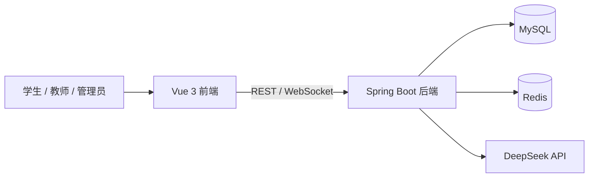

# 智能作业批改系统

一个面向教师、学生和管理员的全栈作业管理与 AI 辅助批改系统。项目覆盖作业发布、在线提交、题库管理、错题本、成绩分析和基于 DeepSeek 的主观题批改流程。

> 求职展示项目：重点体现前后端分离、角色权限控制、业务建模，以及第三方 AI 服务的安全集成。

## 功能亮点

- **多角色业务闭环**：学生提交作业，教师批改与复核，管理员管理用户。
- **AI 辅助批改**：接入 DeepSeek，支持评分、点评和改进建议；API Key 仅从环境变量读取。
- **权限与安全**：Spring Security + JWT；密码使用 BCrypt；敏感配置不进入仓库。
- **可视化学习反馈**：作业统计、学习分析和错题本，帮助追踪学习情况。
- **实时能力**：使用 WebSocket 支持批改过程状态更新。

## 技术栈

| 层次 | 技术 |
| --- | --- |
| 前端 | Vue 3、TypeScript、Vite、Pinia、Element Plus、ECharts |
| 后端 | Java 17、Spring Boot 3、Spring Security、JPA、WebSocket |
| 数据与缓存 | MySQL 8、Redis 7 |
| AI | DeepSeek Chat API |
| 部署 | Docker Compose、Nginx |

## 架构



## 快速启动

### Docker Compose（推荐）

前置条件：Docker Desktop。

```bash
cp .env.example .env
# 编辑 .env，设置强密码、JWT_SECRET；需要 AI 批改时填写 DEEPSEEK_API_KEY
docker compose up --build
```

- 前端：<http://localhost:5173>
- 后端 API：<http://localhost:8080/api>

首次启动时 JPA 会根据实体自动创建表结构。仓库不包含真实业务数据或数据库导出。

### 本地开发

前端要求 **Node.js 20**（仓库中的 `.nvmrc` 已固定版本）；后端要求 Java 17 和 Maven 3.8+。

1. 启动 MySQL（创建 `homework` 数据库）和 Redis。
2. 按 `.env.example` 设置 `DB_URL`、`DB_USERNAME`、`DB_PASSWORD`、`JWT_SECRET` 和可选的 `DEEPSEEK_API_KEY`。
3. 启动后端：`cd backend && mvn spring-boot:run`
4. 启动前端：`cd fronted && npm install && npm run dev`

前端默认请求 `http://localhost:8080/api`；可通过 `VITE_API_BASE_URL` 覆盖。

## 安全说明

- 真实 API Key、数据库密码、证书和 `.env` 文件均被 `.gitignore` 排除。
- 生产环境必须设置强随机的 `JWT_SECRET`，并通过密钥管理服务注入敏感配置。
- 如曾在本地配置文件中使用过真实 API Key，请在对应服务商后台轮换该 Key。

## 目录结构

```text
├── fronted/        # Vue 3 前端（历史目录名，保留以避免破坏现有脚本）
├── backend/        # Spring Boot 后端
├── docker-compose.yml
└── .env.example    # 环境变量模板，不含真实密钥
```

## 后续改进

- [ ] 补充单元、集成和端到端测试
- [ ] 增加 GitHub Actions 持续集成
- [ ] 引入数据库迁移工具（Flyway / Liquibase）
- [ ] 提供在线演示与界面截图

## License

MIT
